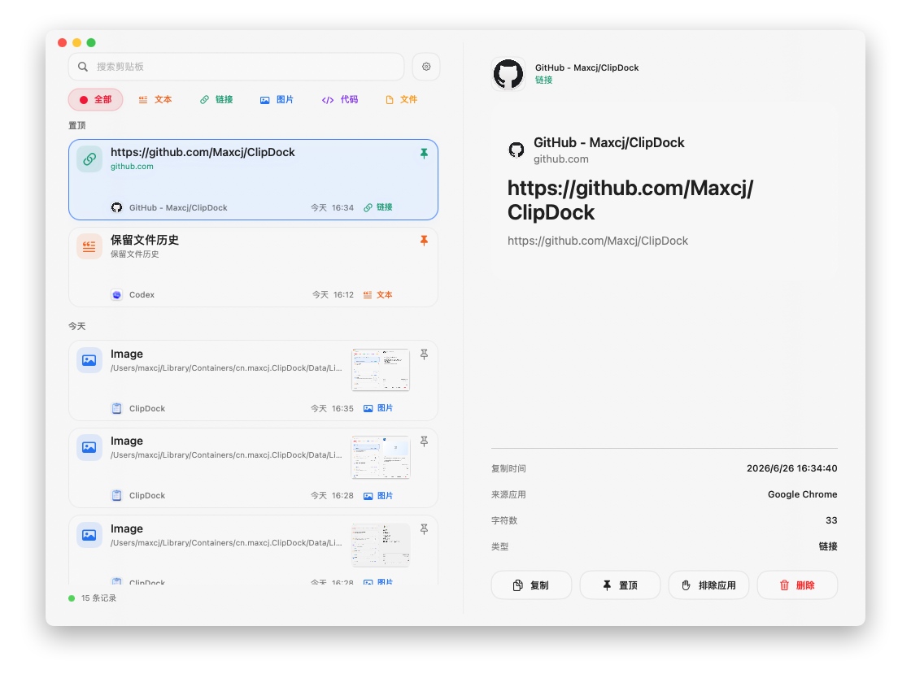
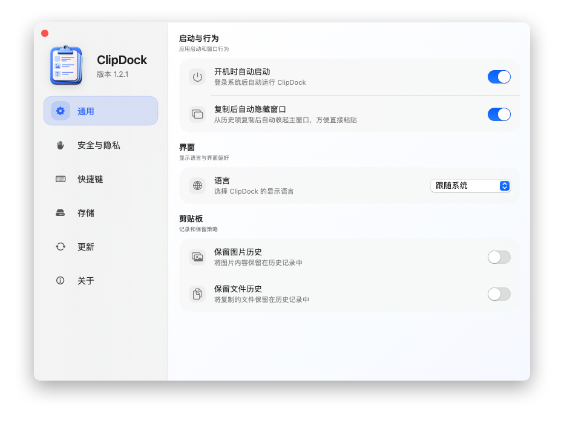
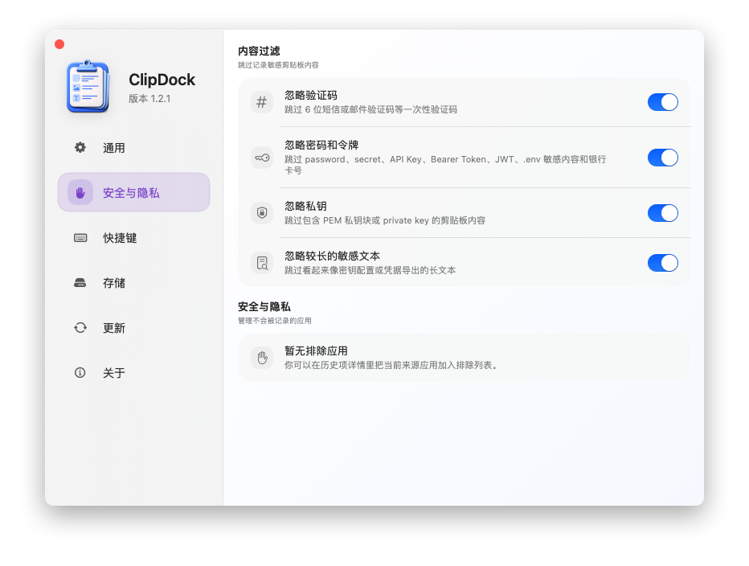
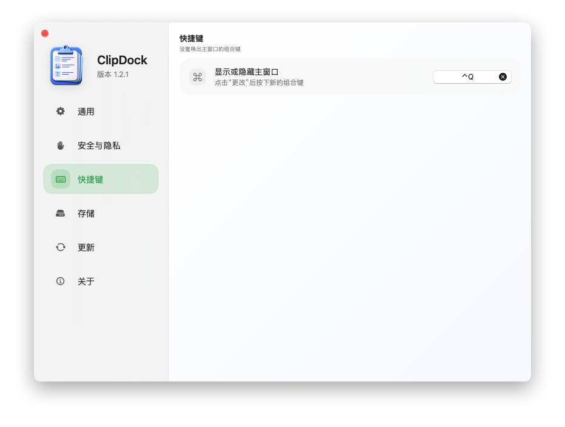
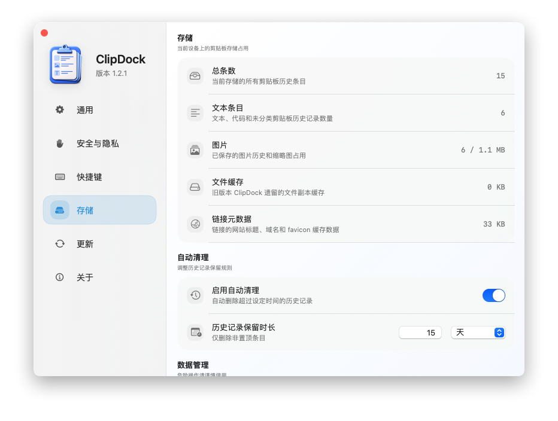
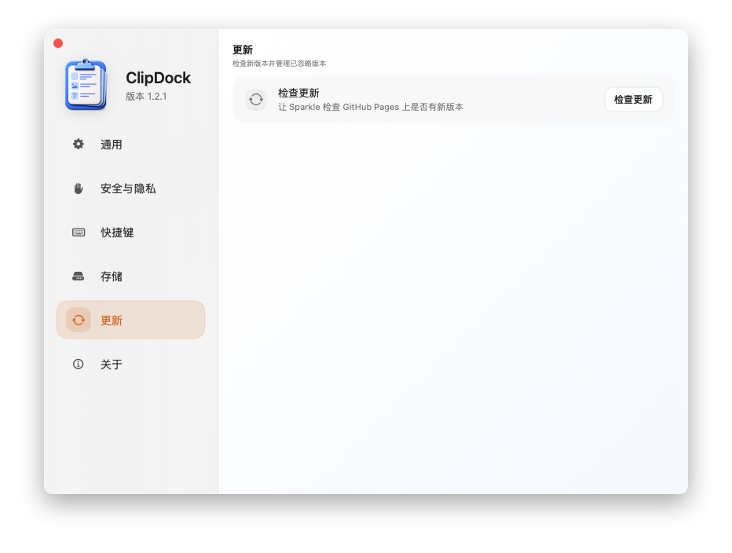
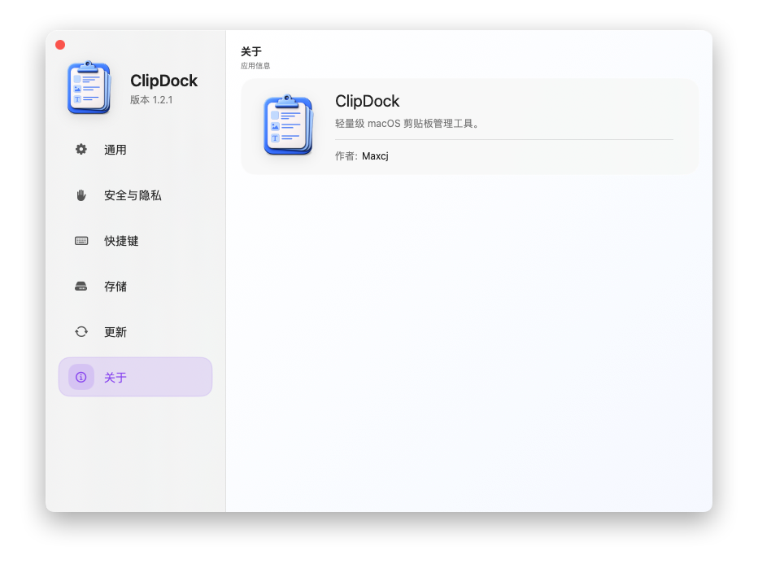

# ClipDock

ClipDock is a lightweight macOS clipboard manager built for fast capture, quick recall, and low-friction reuse.

中文说明: [README.zh-CN.md](README.zh-CN.md)

It lives in the menu bar, stays out of the Dock, and lets you bring up the main window instantly with a global hotkey.

## Screenshots

## Features

- Menu bar first workflow
- Global hotkey to show or hide the main window
- Clipboard history for text, links, images, files, code snippets, and colors
- Rich previews for links, images, files, colors, and code
- Custom categories with visibility control and drag-to-reorder
- Assign clipboard items to up to 3 custom categories
- One-click color copy as HEX, RGB, or RGBA
- Code language detection and lightweight syntax highlighting
- Code actions for Copy as Markdown, Pretty JSON, and Minify JSON
- Quick actions for copy, pin, delete, and exclude-source-app
- Per-item metadata for faster scanning
- Localized UI in English and Simplified Chinese

## Clipboard History

- Text, links, images, files, code snippets, and colors are captured automatically
- Image history can be enabled or disabled in Settings
- File history can be enabled or disabled in Settings
- Color detection and copying are built in
- Sensitive clipboard content can be filtered out in Settings
- You can ignore a specific update version from the Updates tab

## Updates

ClipDock uses [Sparkle](https://sparkle-project.org/) for automatic updates.

Update distribution is split across GitHub services:

- GitHub Releases hosts the downloadable app archive
- GitHub Pages hosts `appcast.xml`
- Sparkle handles update detection, download, verification, and installation

The update feed is:

`https://maxcj.github.io/ClipDock/appcast.xml`

## Getting Started

1. Download or build ClipDock.
2. Launch the app and allow clipboard access if prompted by macOS.
3. Use the menu bar icon or the global hotkey to open the main window.
4. Open Settings to adjust history retention, content filters, and update preferences.

## Build

Requirements:

- macOS 13.2 or later
- Xcode 14.3 or later

Open `code/ClickDock/ClickDock.xcodeproj` in Xcode and build the `ClickDock` scheme.

## Release Notes

Release notes for published versions live under:

`docs/release-notes/<version>/`

## Project Structure

- `code/ClickDock/ClickDock/` application source
- `docs/` GitHub Pages assets and appcast feed
- `scripts/` helper scripts for release publishing
- `icon/` app icon source assets
- `ui/` screenshots and UI references

## License

See [LICENSE](LICENSE).
